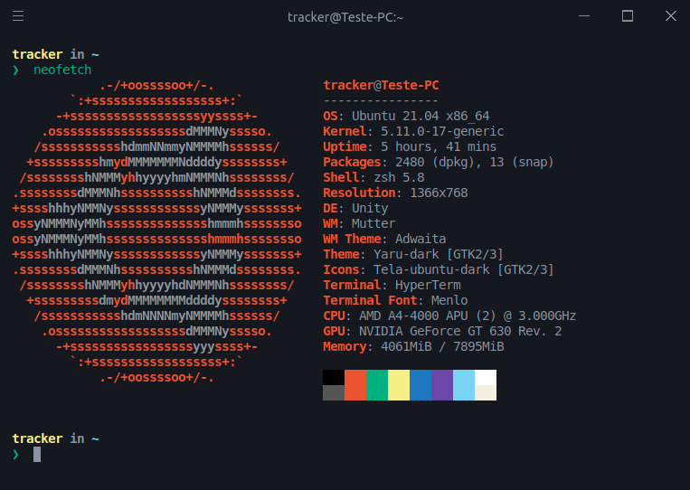

# **Se liga rapezie! 🙅‍♂️**

## My name is Breno and I'm a Computer Networking student at FAETEC | DevOps Enthusiast | Linux.

- I'm from Brazil, living in Rio de Janeiro 🇧🇷

- 17 years old 🙂 

- Headbanger and Progger 🖤

- I like to work with Linux, Ansible, Terraform, Python and other tools in this incredible and fun open source world 🔌

- I believe that Ambition, teamwork, focus and determination surpass any talent! 🤝

- "The most merciful thing in the world is, in my view, the inability of the human mind to correlate everything it knows." H.P. Lovecraft 🐙🦑

# **My workspace 💻**

# **My favorite tools 🛠️**

# **My books** 📚
> _A coleção tá pequena ainda._

- Descobrindo o Linux: Entenda o Sistema Operacional GNU/Linux 🐧 

- Análise de Tráfego em Redes TCP/IP: Utilize Tcpdump na Análise de Tráfegos em Qualquer Sistema Operacional 🌐  

- H.P. Lovecraft - Medo Clássico - Vol. 1 - Cosmic Edition: O mestre dos mestres para todas as gerações 🐙🦑